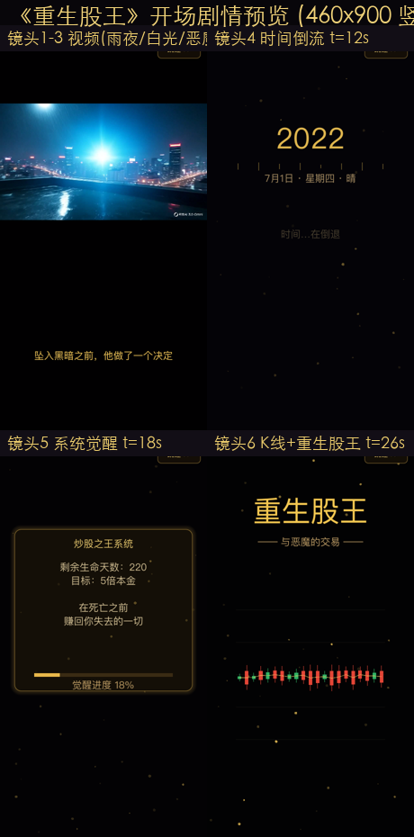
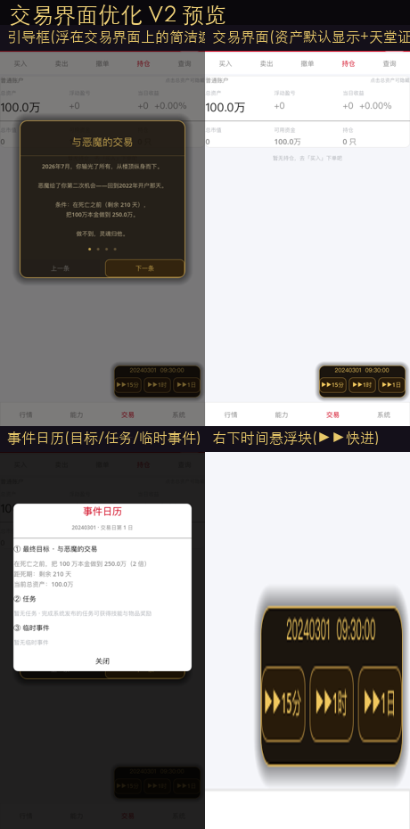
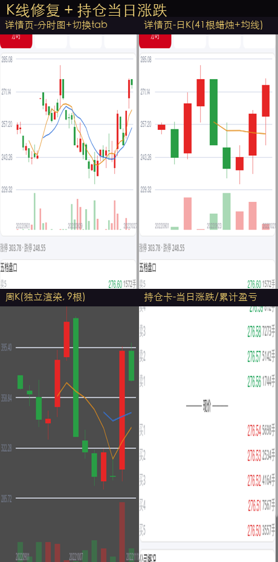
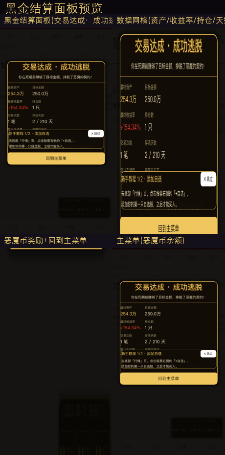

# 重生股神

> **与恶魔签订契约的 Roguelike 模拟炒股游戏** —— 从 A 股真实历史数据中重活一次，在死期前赚回你失去的一切。

2026 年 7 月，你炒股亏光积蓄，从天台纵身而下。弥留之际，一个存在向你伸出手：
*「签下契约，重生回到 2022 年开户那天。在死亡日期前，把 100 万做到目标金额——做不到，灵魂归我。」*

你醒来了。重生股神系统已经觉醒。

---

## 🎮 游戏介绍

| | |
|---|---|
| **类型** | Roguelike 模拟经营 + 冒险 |
| **引擎** | Godot 4.7.2（移动端竖屏 460×900） |
| **难度** | 7 档（难度一~七：死亡第 220→160 日、目标 2→5 倍本金） |
| **数据** | 行情裁剪自 **A 股真实历史**（1 分钟 OHLCV），**每局随机洗牌**——股票↔数据、历史↔游戏日全部重新匹配，别相信你的记忆 |

### 核心玩法
- **真实 A 股交易规则**：T+1、动态涨跌停（主板 10% / 创业板科创板 20% / 北交所 30% / ST 5%）、佣金+印花税+过户费、限价挂单撮合（收盘自动作废）、最多同时持有 30 只
- **行情系统**：分时 / 日K / 周K / 月K 四视图（蜡烛图+MA 均线）、五档盘口、公司概况、板块精选、涨跌排行
- **时间推进**：+15分 / +1时 / +1日 / 快进30日（跨午休自动跳转、尾盘自动收至收盘）
- **恶魔交易**：每次翻天地弹出"剩余天数·目标差值"，死期结算——成功奖励**恶魔交易币**（可在恶魔果实界面使用，兑换系统开发中）
- **新手引导**：4 页契约引导 + 两步实操教程（加自选 → 试买入）

## 📸 截图

| 开场剧情动画 | 交易界面 |
|---|---|
|  |  |

| K线（日/周/月） | 黑金结算面板 |
|---|---|
|  |  |

## 🚀 开发进展

### 版本状态：**-0.1 A 测**（2026-08-24 发布安卓测试包）

| 模块 | 状态 |
|------|------|
| 主菜单 / 难度切换 / 恶魔果实 | ✅ |
| 开场剧情（AI 视频 + 程序化动画 26.85s） | ✅ |
| 交易界面（行情/能力/交易/系统 四页） | ✅ |
| 买入/卖出/撤单/持仓/查询 | ✅（含快速买卖面板） |
| 个股详情（分时/K线/五档/公司信息/下单） | ✅ |
| 行情页（搜索/排行/板块/自选） | ✅ |
| 引导框 + 新手教程 | ✅ |
| 黑金结算面板 + 恶魔交易币持久化 | ✅ |
| 时间系统（连续日历/午休/快进30日/翻天提示） | ✅ |
| 数据管线（洗牌/连续日历/价格归一化/涨跌停钳制） | ✅ |
| 安卓 A 测包 | ✅ v0.1 |

### 路线图
- **P1 交易打磨**：五档真实化、行情榜完善、自选排序
- **P2 Roguelike**：能力系统（觉醒抽卡/技能接入引擎）、任务系统
- **P3 闭环**：存档系统、设置、音效、结算完善
- **P4 真实**：ST/除权除息、数据扩展、安卓首启加载优化
- **P5 打包发布**（正式签名）

## 🛠 技术栈

- **Godot 4.7.2**（GL Compatibility 渲染，移动端友好）+ GDScript
- **数据管线**（Python）：A 股 1 分钟数据 → bin 二进制包 → 游戏内洗牌/归一化
- **打包字体**：Noto Sans CJK（安卓无苹果字体必须自带）

## 📁 目录结构

```
├── godot/                  # Godot 项目（开发主体）
│   ├── scripts/            # 16 个 GDScript（数据层/引擎/UI/自绘）
│   ├── scenes/             # 主菜单 / 剧情 / 交易界面
│   ├── game_data/game/     # 260 天精简数据包（运行时必需，git 不入库）
│   └── assets/             # 剧情视频 ogv / 字体 / 资源
├── scripts/                # 数据生成脚本（Python）
└── HANDOFF.md              # ★ 开发者交接文档（先读它）
```

## ▶️ 运行

```bash
# 本地运行（需 Godot 4.7.2 + godot/game_data/ 数据）
Godot --path godot/ --editor    # 或直接运行 project.godot
```

- **数据包**：`godot/game_data/`（260 天）不在 git 仓库内，需从发布包获取
- **安卓打包**：详见 `HANDOFF.md` §10（含 Godot sparse pck 手动补数据流程）

## 📄 文档

- [HANDOFF.md](HANDOFF.md) — 开发者交接文档：数据格式、引擎规则、GDScript 铁律、已知坑、打包命令
- [迁移清单.md](迁移清单.md) — Windows 环境搭建与双机协作

---

*数据来源：A 股真实历史行情（模拟用途，游戏内随机重排）。红涨绿跌。祝你好运——也别忘了，恶魔正看着你。*
